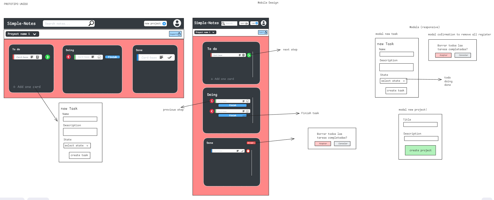

# Simple-Notes

### **Estado del Proyecto: En Progreso** 🚧

## Descripción
Simple-Notes es una aplicación web que permite a los usuarios crear y gestionar notas en diferentes estados: **Todo**, **Doing**  y **Done**. Esta herramienta es ideal para organizar tareas y proyectos de manera sencilla y efectiva.

## Flujo de Trabajo con Gitflow

Este proyecto sigue el flujo de trabajo de **Gitflow** para una mejor organización y control de versiones. La rama `main` contiene la versión estable, mientras que los cambios y nuevas funcionalidades se desarrollan en la rama `develop`.

### ¿Para ver los cambios más recientes?
¡Revisa la rama `develop` para estar al tanto de las últimas actualizaciones y mejoras en desarrollo del proyecto! 🚀


## Tecnologías Utilizadas

- **HTML**: Para la estructura del contenido.
- **SASS**: Para estilos avanzados y preprocesamiento CSS.
- **TypeScript**: Para una programación más robusta y tipada.
- **Angular**: Para la creación de aplicaciones web dinámicas.
- **Tailwind CSS + componentes de flowbite**: Para un diseño responsivo y utilitario.


## Diseño del Proyecto 🎨


Puedes ver el diseño completo de la aplicación en Excalidraw haciendo clic en:

[](https://excalidraw.com/#json=CpfFCE7qVS1EHDYLc99n0,Crnw3EkvL-JFWjPxJNAMxA)

### Prototype

### avance (10/17/2024)


## Características

- **Gestión de Proyectos**: Permite la creación y gestión de proyectos con notas clasificadas en tres estados:
  - **Todo**: Notas que están pendientes.
  - **Doing**: Notas que están en progreso.
  - **Done**: Notas que han sido completadas.
  
- **Almacenamiento Local**: Los datos se almacenan en `localStorage`, lo que permite que las notas se mantengan a través de sesiones (hasta que se borren los datos del navegador).

- **Exportación de Datos**: Permite guardar un registro de las notas en un archivo `txt`, facilitando el acceso y la gestión fuera de la aplicación.


## Instalación

1. Clona este repositorio:
   ```bash
   git clone https://github.com/SoyKevin111/simple-notes.git
2. Instala las dependencias:
	```
	npm install
3. Ejecuta el servidor local
	```bash
	ng serve
.


